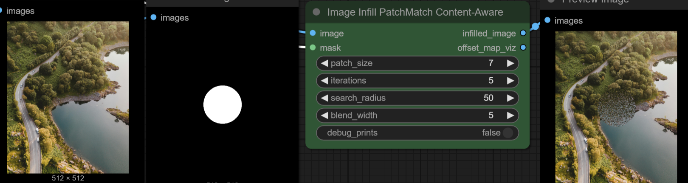
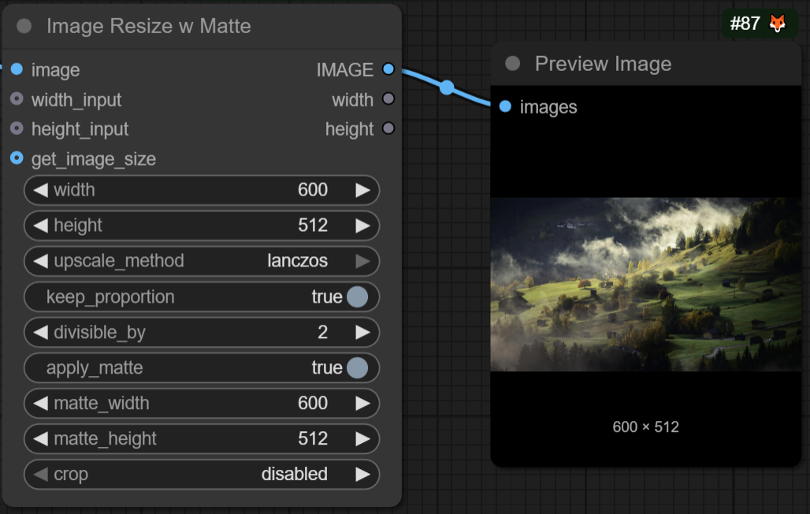
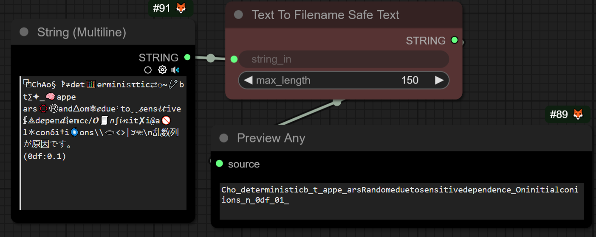
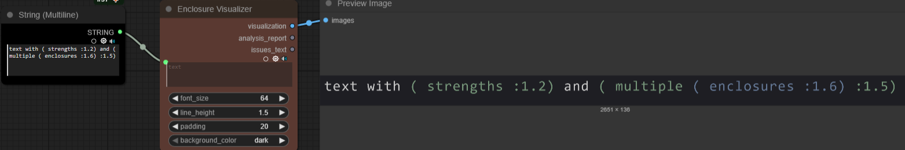
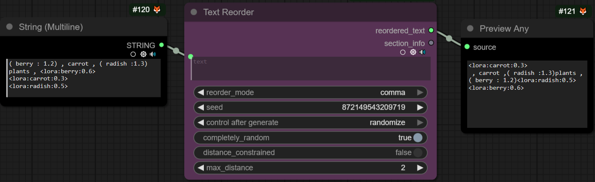

   

# ComfyUI illumorae

comfyUI custom nodes focused on randomization and image variant exploration
- loading files by partial string match , randomizing lora string strength , text reordering
- load and save with external folderpath and filename outputs for project structures
- each node is self-contained and could be installed separately if prefer specific nodes

# install 
- install thru the [ComfyUI Manager](https://github.com/Comfy-Org/ComfyUI-Manager) search for "illumorae" or manually [download](https://github.com/CorvaeOboro/ComfyUI_illumorae/archive/refs/heads/main.zip) as a zip and extract as folder into the ComfyUI `custom_nodes` directory 
- OPTIONAL may install nodes individually by copying a nodes subfolder into the ComfyUI `custom_nodes` directory , each has been setup to function independently

# nodes 

<table>
  <thead>
    <tr>
      <th>Checkpoint</th>
      <th>LoRA</th>
      <th>Load</th>
      <th>Image</th>
      <th>Text</th>
      <th>Save</th>
    </tr>
  </thead>
 <tbody>
    <tr>
      <td>
        <ul style="list-style-type: disc; padding-left: 1.2em;">
          <li><a href="#checkpoint-loader-by-string-dirty">Checkpoint Loader By String Dirty</a></li>
          <li><a href="#checkpoint-random-selector">Checkpoint Random Selector</a></li>
        </ul>
      </td>
      <td>
        <ul style="list-style-type: disc; padding-left: 1.2em;">
          <li><a href="#lora-text-strength-variants">LoRA Text Strength Variants</a></li>
          <li><a href="#lora-text-strength-multiplier">LoRA Text Strength Multiplier</a></li>
          <li><a href="#lora-text-visualizer">LoRA Text Visualizer</a></li>
        </ul>
      </td>
      <td>
        <ul style="list-style-type: disc; padding-left: 1.2em;">
          <li><a href="#load-image-filepath-out">Load Image FilePath Out</a></li>
          <li><a href="#load-image-random-variants">Load Image Random Variants</a></li>
          <li><a href="#load-text-file-graceful">Load Text File Graceful</a></li>
          <li><a href="#select-item-by-amount-generated">Select ITEM by Amount Generated</a></li>
        </ul>
      </td>
      <td>
        <ul style="list-style-type: disc; padding-left: 1.2em;">
          <li><a href="#image-clahe">Image CLAHE</a></li>
          <li><a href="#image-infill-dilation">Image Infill Dilation</a></li>
          <li><a href="#image-infill-patchmatch">Image Infill PatchMatch</a></li>
          <li><a href="#image-multi-scale-retinex-color-restoration">Image Multi-Scale Retinex Color Restoration</a></li>
          <li><a href="#video-resize-matte">Video Resize Matte</a></li>
          <li><a href="#image-resize-flux-kontext-options">Flux Kontext Image Scale Options</a></li>
          <li><a href="#vlm-internvl-local">VLM InternVL Local</a></li>
        </ul>
      </td>
      <td>
        <ul style="list-style-type: disc; padding-left: 1.2em;">
          <li><a href="#text-to-string-safe-for-filename">Text To Filename Safe Text</a></li>
          <li><a href="#text-token-count">Text Token Count</a></li>
          <li><a href="#text-strength-multiplier">Text Strength Multiplier</a></li>
          <li><a href="#text-enclosure-visualizer">Text Enclosure Visualizer</a></li>
          <li><a href="#text-reorder">Text Reorder</a></li>
        </ul>
      </td>
      <td>
        <ul style="list-style-type: disc; padding-left: 1.2em;">
          <li><a href="#save-image-extended-folderpath">Save Image Extended FolderPath</a></li>
          <li><a href="#save-animated-webp-extended-folderpath">Save Animated WebP Extended FolderPath</a></li>
        </ul>
      </td>
    </tr>
  </tbody>
</table>

---

## Checkpoint
- **[Checkpoint Loader By String Dirty](./ComfyUI_illumorae_CheckpointLoaderByStringDirty/checkpoint_loader_by_string_dirty.py)**  
  Loads a checkpoint by matching a partial string input to closest registered checkpoint.
- **[Checkpoint Random Selector](./ComfyUI_illumorae_CheckpointRandomSelector/checkpoint_random_selector.py)**  
  Randomly selects a checkpoint from a category/folder at a set interval for model rotation.

## LoRA 
- **[LoRA Text Strength Variants](./ComfyUI_illumorae_LoraTextStrengthVariants/lora_text_strength_variants.py)**  
  Parses LoRA strings and randomizes or highlights strengths within specified limits.
- 
- **[LoRA Text Strength Multiplier](./ComfyUI_illumorae_LoraTextStrengthMultiplier/lora_text_strength_multiplier.py)**  
  Multiplies and caps LoRA strengths, with options for total and individual caps.
- 
- **[LoRA Text Visualizer](./ComfyUI_illumorae_LoraTextVisualizer/lora_text_visualizer.py)**  
  Visualizes LoRA strengths in prompt text as a word plot image.
- 
## Load
- **[Load Image FilePath Out](./ComfyUI_illumorae_LoadImageFilePathOut/load_image_filepath_out.py)**  
  Loads an image from a file path and outputs the image, mask, file name, and folder path.
- **[Load Image Random Variants](./ComfyUI_illumorae_LoadImageRandomVariants/load_image_random_variant.py)**  
  Loads a random variant of an image from a folder, with suffix options.
- **[Load Text File Graceful](./ComfyUI_illumorae_LoadTextFileGraceful/load_text_file_graceful.py)**  
  Loads text from a file, gracefully handling missing/invalid files.
- 
- **[Select ITEM by Amount Generated](./ComfyUI_illumorae_SelectITEMbyAmountGenerated/select_item_by_amount_generated.py)**  
  Selects an ITEM output based on how many images/frames have been generated so far.

## Image Processing
- 

- **[Image CLAHE (Contrast Limited Adaptive Histogram Equalization)](./ComfyUI_illumorae_ImageContrastLimitedAdaptiveHistogramEqualization/image_CLAHE.py)**  
  Enhances local image contrast using CLAHE.
- **[Image Infill Dilation](./ComfyUI_illumorae_ImageInfillSimple/image_infill_dilation.py)**  
  image infill using Simple dilation expansion.
- **[Image Infill PatchMatch](./ComfyUI_illumorae_ImageInfillPatchMatch/image_infill_patchmatch.py)**  
  PatchMatch-based image infill.
- 
- **[Image Multi-Scale Retinex Color Restoration](./ComfyUI_illumorae_ImageMultiScaleRetinexColorRestoration/image_MSRCR.py)**  
  Applies Multi-Scale Retinex with Color Restoration for dynamic range and color enhancement.
- **[Video Resize Matte](./ComfyUI_illumorae_VideoResizeMatte/image_resize_matte_video.py)**  
  Resizes video frames with matte options for compositing.
- 
- **[Image Resize Flux Kontext Options](./ComfyUI_illumorae_ImageResizeFluxKontextOptions/flux_kontext_image_scale_options.py)**  
  Resizes images for optimal Flux Kontext input, with cropping/stretching options.

## Text & Prompt Utilities
- **[Text To String Safe For Filename](./ComfyUI_illumorae_TextToStringSafeForFilename/text_to_text_safe_for_filename.py)**  
  Converts text into a filename-safe string.
- 
- **[Text Token Count](./ComfyUI_illumorae_TextTokenCount/text_token_count.py)**  
  Counts tokens in a string using clip
- 
- **[Text Strength Multiplier](./ComfyUI_illumorae_TextStrengthMultiplier/text_strength_multiplier.py)**  
  Multiplies the strength of text prompt components.
- 
- **[Text Enclosure Visualizer](./ComfyUI_illumorae_TextEnclosureVisualizer/text_enclosure_visualizer.py)**  
  Visualizes enclosed text , nested separation , and warnings on open ended enclosures
- 
- **[Text Reorder](./ComfyUI_illumorae_TextReorder/text_reorder.py)**  
  Reorders prompt text using different scales of rules.
- 

## Save
- **[Save Image Extended FolderPath](./ComfyUI_illumorae_SaveImageExtendedFolderPath/save_image_extended_folderpath.py)**  
  Saves images to an external folder path, supporting custom folder and filename formats.
- **[Save Animated WebP Extended FolderPath](./ComfyUI_illumorae_SaveAnimatedWebPExtendedFolderPath/save_animated_webp_extended_folderpath.py)**  
  Saves animated WebP images to a user-specified folder.

# LICENSE
- free to all , [creative commons zero CC0 1.0](https://creativecommons.org/publicdomain/zero/1.0/) , free to re-distribute , attribution not required